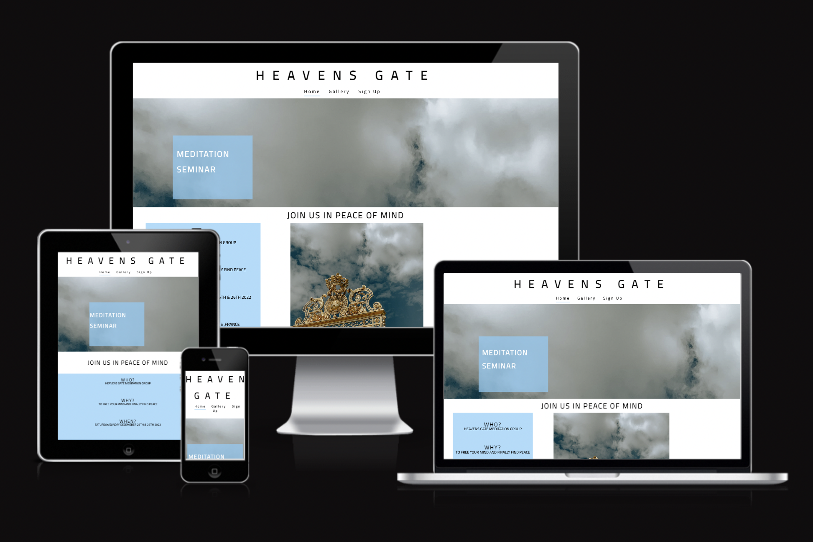
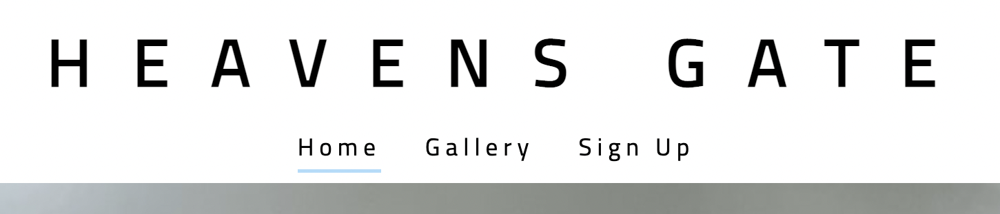
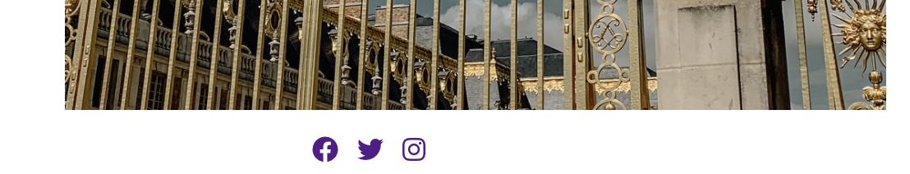
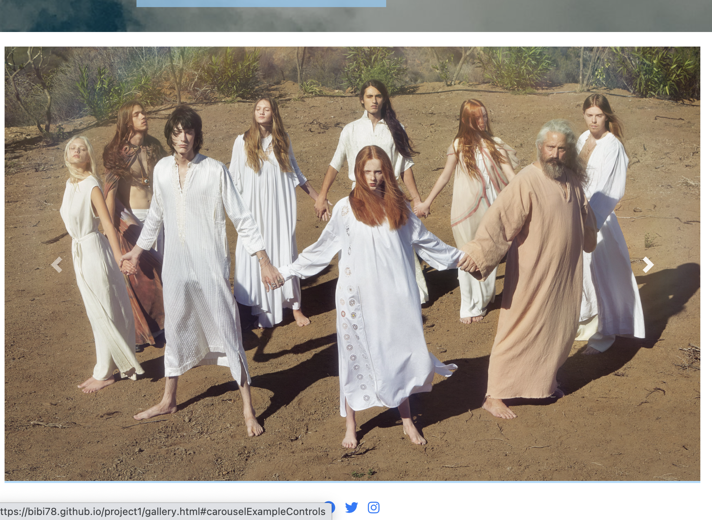
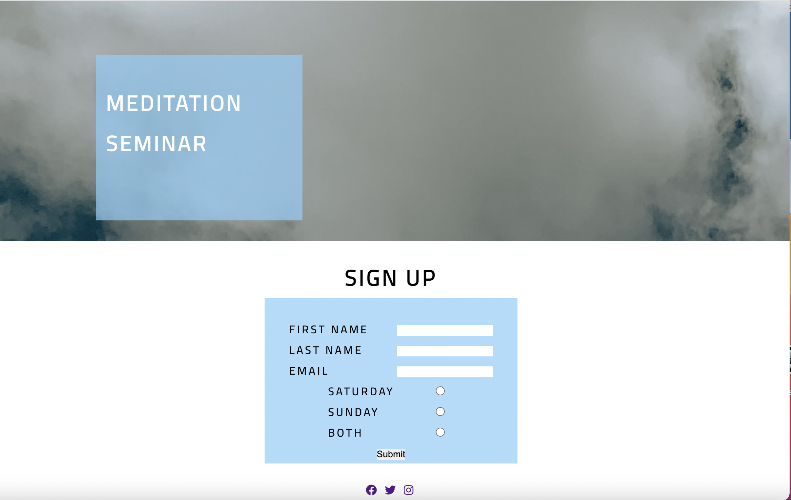

# PROJECT 1! 

Free YSL
[Project 1](https://bibi78.github.io/project1/index.html)

## h2
### h3

# Features

This website is for a meditation seminar in Paris,France

1. Navigation Bar
 * Responsive, 
 * Center aligned and on all three pages.

2. Landing Page 
* The landing page gives a brief overview of what the site is for and the purppose of its creation.

3. Footer 
* links to the the relavent social media platforms

4. Gallery Page
* A slide show showing a few photos giveing the user a preview of what the seminar looks like.
* the slide show is created using bootstrap.
* Also Responsive

5. Sign Up Page
* A responsive sign up page
* Allows the user to pick the days they woould like to join the seminar and sign up.

# Testing

### HTML/CSS Validator

* No errors were returned when passing through the official [W3 validator](https://validator.w3.org/nu/?doc=https%3A%2F%2Fbibi78.github.io%2Fproject1%2F)

* CSS

# Unfixed Bugs 

* getting eveything to be responsive got tricky. not sure everything is perfect.

# Deployment

* The site was deployed using Github pages.
* All the directions given in the course video were followed.
* The site is linked here https://bibi78.github.io/project1/

# Credits 
## Content
* The basic outline comes from the [Code Institute](https://learn.codeinstitute.net/dashboard) tutorials.
* The icons in the footer were taken from [Font Awesome](https://fontawesome.com/icons)
* The font came from [Google Fonts](https://fonts.google.com/)
* The javascript for the slide show came from [Bootstrap](https://getbootstrap.com/docs/4.0/components/carousel/)

## Media 
* All images came from Google.

